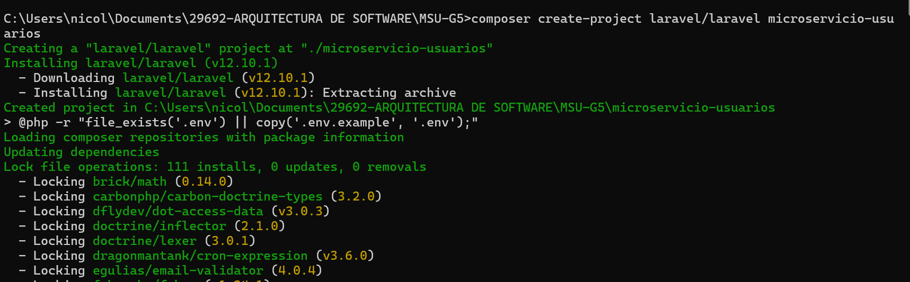
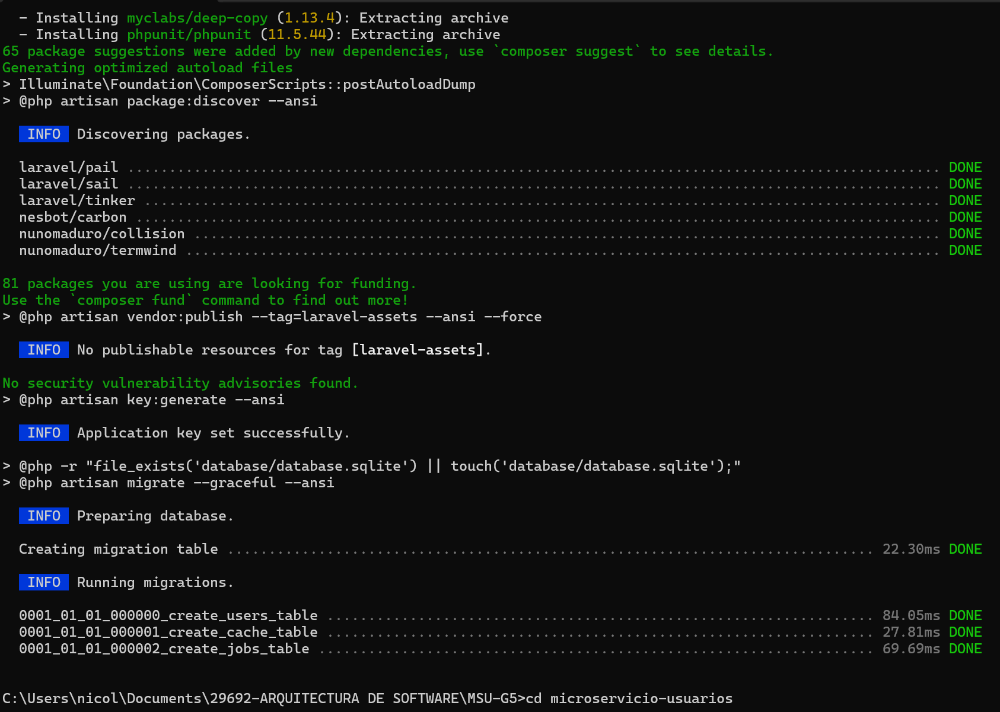
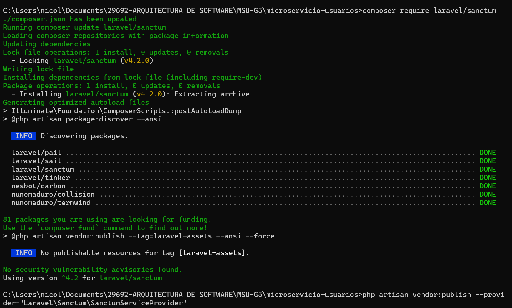
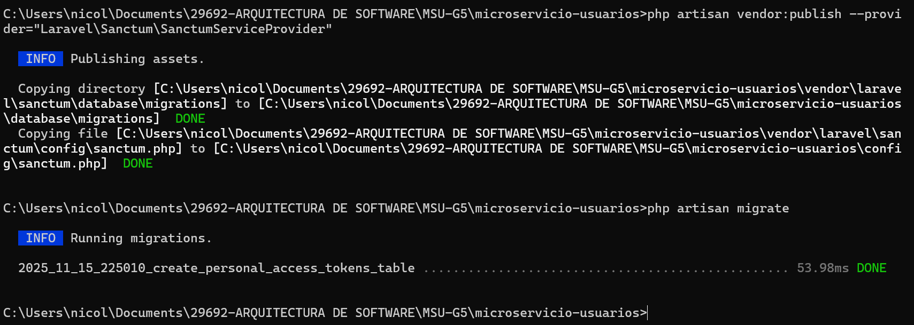
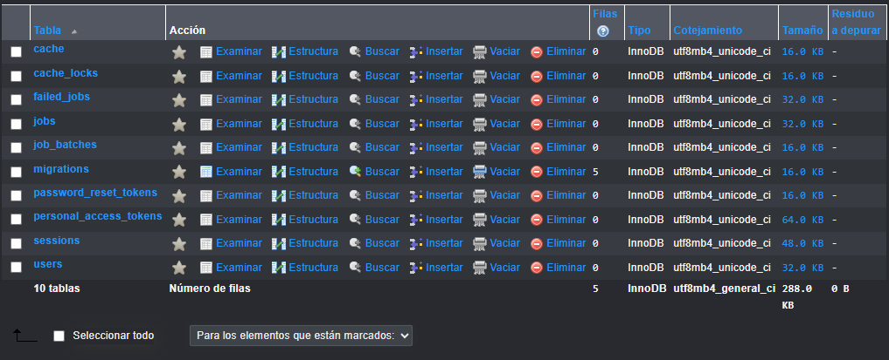
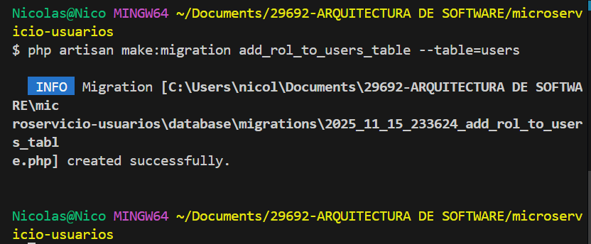
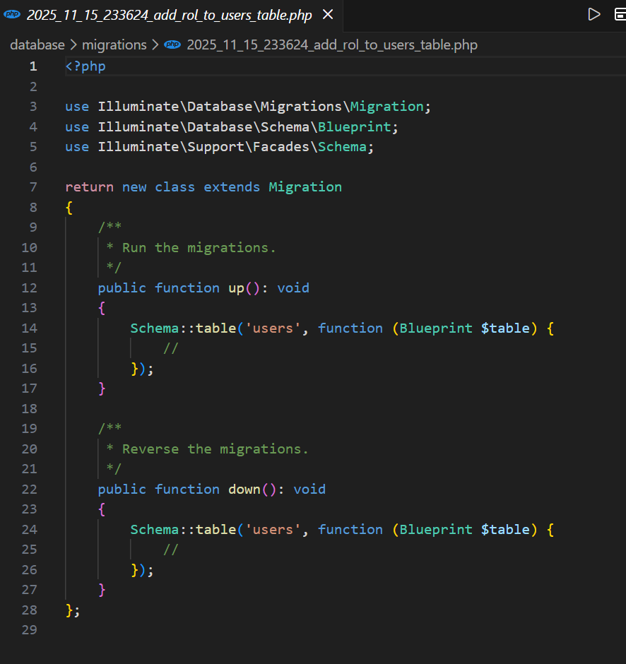
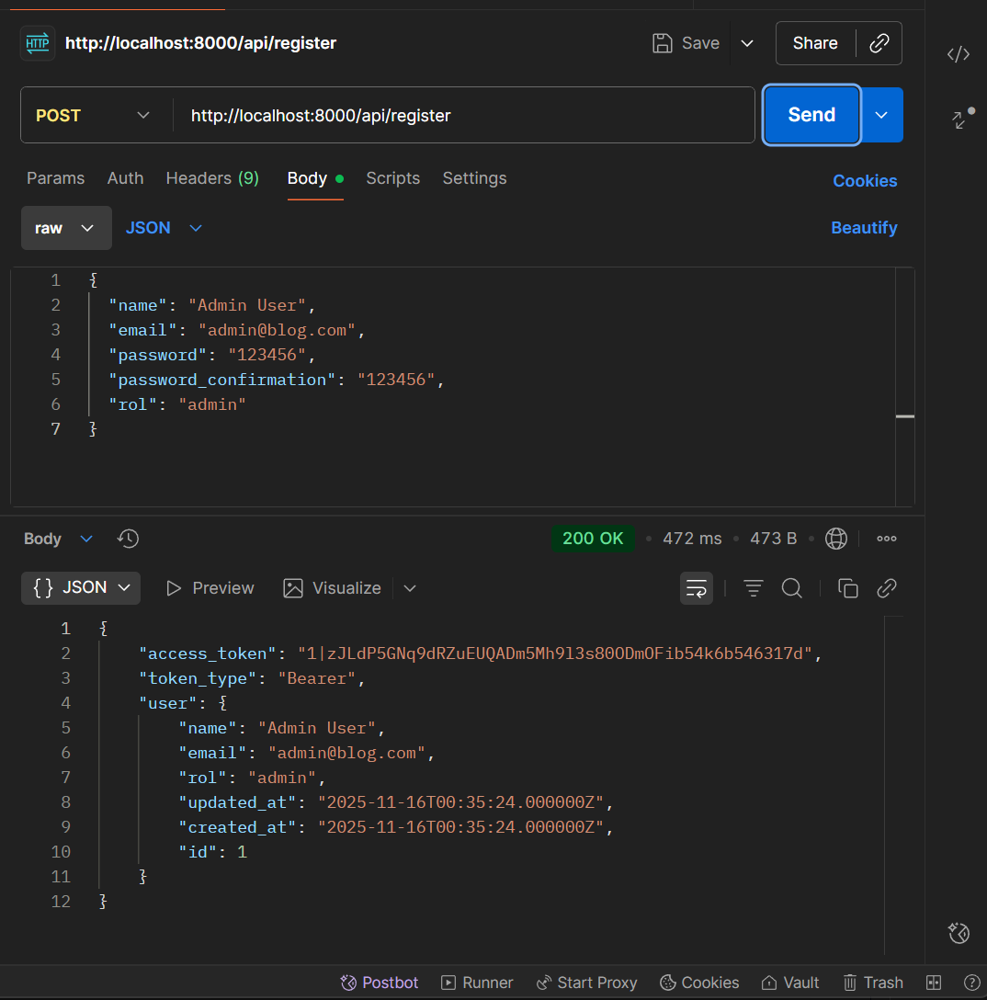
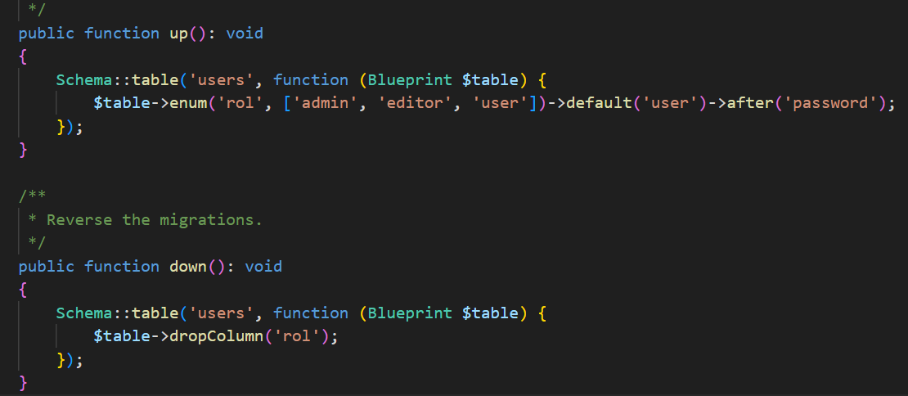

<p align="center"><a href="https://laravel.com" target="_blank"></a></p>


### Arquitectura de software - Grupo 5  

## Integrantes


-  DOMINGUEZ OSCAR
-  VILLAMARIN VICTOR
-  GUAMIALAMA NICOLAS
-  POAQUIZA MARCO
-  TENEMAZA ALANIS


### Microservicio de Gestión de Usuarios  
**Arquitectura de Software – Sistema de Blog**  

---

### 1. Objetivo  
Proveer un servicio autónomo de identidad que centralice el **registro**, **autenticación** y **control de acceso** basado en roles (`admin`, `editor`, `user`) para el ecosistema de microservicios del blog.  
El componente emite tokens seguros (Laravel Sanctum) que el resto de servicios (Posts, Comentarios, Notificaciones) puede validar sin dependencia de sesiones compartidas.

---

### 2. Stack Tecnológico  
| Capa              | Tecnología               |
|-------------------|--------------------------|
| Lenguaje          | PHP 8.2+                 |
| Framework         | Laravel 12               |
| Autenticación     | Laravel Sanctum (tokens) |
| Base de datos     | MySQL 8 /                |
| Formato de API    | REST + JSON              |


#### Instalacion 


##### instalacion de sanctum




#### Creacion Base de Datos (mcs_usuarios)


#### Migrationes




adecuacion del entorno 


#### Registro 

---

### 3. Arquitectura & Responsabilidades  
- **Registro** de nuevos usuarios con rol explícito.  
- **Login** + emisión de `Bearer token`.  
- **Validación de token** vía middleware `auth:sanctum`.  
- **Cierre de sesión** con revocación inmediata del token.  
- **Perfil autenticado** (`/me`) para consulta de datos propios.  
- **Middleware de roles** (`role:admin|editor|user`) reusable por otros servicios.

---

### 4. Modelo de Datos  
**Tabla `users`**  
| Campo        | Tipo     | Descripción                  |
|--------------|----------|------------------------------|
| id           | bigint   | PK autoincremental           |
| name         | string   | Nombre completo              |
| email        | string   | Único, índice                |
| password     | string   | Hash bcrypt                  |
| rol          | enum     | `admin`, `editor`, `user`    |
| timestamps   | datetime | created_at / updated_at      |

#### Asisgnacion

---

### 5. Endpoints Principales  
Base URL: `http://localhost:8000/api`

| Método | Endpoint        | Headers        | Payload (JSON) | Respuesta |
|--------|-----------------|----------------|----------------|-----------|
| POST   | `/register`     | Content-Type: application/json | `{name, email, password, password_confirmation, rol}` | 201 + token |
| POST   | `/login`        | ‑-             | `{email, password}` | 200 + token |
| POST   | `/logout`       | Authorization: Bearer `token` | ‑- | 200 {message} |
| GET    | `/me`           | Authorization: Bearer `token` | ‑- | 200 {user} |

---

### 6. Seguridad  
- Contraseñas hasheadas con `bcrypt` (10 rounds).  
- Tokens de acceso de 40 caracteres, almacenados hasheados (`sha256`).  
- Middleware `auth:sanctum` protege rutas sensibles.  
- Middleware personalizado `role` restringe acciones por perfil.  
- Sin almacenamiento de sesiones en servidor (stateless).

---

### 7. Instalación Rápida  

```bash
# 1. Clonar o generar proyecto
composer create-project laravel/laravel microservicio-usuarios
cd microservicio-usuarios

# 2. Dependencias
composer require laravel/sanctum
php artisan vendor:publish --provider="Laravel\Sanctum\SanctumServiceProvider"
php artisan migrate

# 3. Configurar DB en .env
DB_DATABASE=microservicio_usuarios
DB_USERNAME=root
DB_PASSWORD=

# 4. Levantar
php artisan serve

## About Laravel

Laravel is a web application framework with expressive, elegant syntax. We believe development must be an enjoyable and creative experience to be truly fulfilling. Laravel takes the pain out of development by easing common tasks used in many web projects, such as:

- [Simple, fast routing engine](https://laravel.com/docs/routing).
- [Powerful dependency injection container](https://laravel.com/docs/container).
- Multiple back-ends for [session](https://laravel.com/docs/session) and [cache](https://laravel.com/docs/cache) storage.
- Expressive, intuitive [database ORM](https://laravel.com/docs/eloquent).
- Database agnostic [schema migrations](https://laravel.com/docs/migrations).
- [Robust background job processing](https://laravel.com/docs/queues).
- [Real-time event broadcasting](https://laravel.com/docs/broadcasting).

Laravel is accessible, powerful, and provides tools required for large, robust applications.

## Learning Laravel

Laravel has the most extensive and thorough [documentation](https://laravel.com/docs) and video tutorial library of all modern web application frameworks, making it a breeze to get started with the framework. You can also check out [Laravel Learn](https://laravel.com/learn), where you will be guided through building a modern Laravel application.

If you don't feel like reading, [Laracasts](https://laracasts.com) can help. Laracasts contains thousands of video tutorials on a range of topics including Laravel, modern PHP, unit testing, and JavaScript. Boost your skills by digging into our comprehensive video library.

## Laravel Sponsors

We would like to extend our thanks to the following sponsors for funding Laravel development. If you are interested in becoming a sponsor, please visit the [Laravel Partners program](https://partners.laravel.com).

### Premium Partners

- **[Vehikl](https://vehikl.com)**
- **[Tighten Co.](https://tighten.co)**
- **[Kirschbaum Development Group](https://kirschbaumdevelopment.com)**
- **[64 Robots](https://64robots.com)**
- **[Curotec](https://www.curotec.com/services/technologies/laravel)**
- **[DevSquad](https://devsquad.com/hire-laravel-developers)**
- **[Redberry](https://redberry.international/laravel-development)**
- **[Active Logic](https://activelogic.com)**

## Contributing

Thank you for considering contributing to the Laravel framework! The contribution guide can be found in the [Laravel documentation](https://laravel.com/docs/contributions).

## Code of Conduct

In order to ensure that the Laravel community is welcoming to all, please review and abide by the [Code of Conduct](https://laravel.com/docs/contributions#code-of-conduct).

## Security Vulnerabilities

If you discover a security vulnerability within Laravel, please send an e-mail to Taylor Otwell via [taylor@laravel.com](mailto:taylor@laravel.com). All security vulnerabilities will be promptly addressed.

## License

The Laravel framework is open-sourced software licensed under the [MIT license](https://opensource.org/licenses/MIT).
